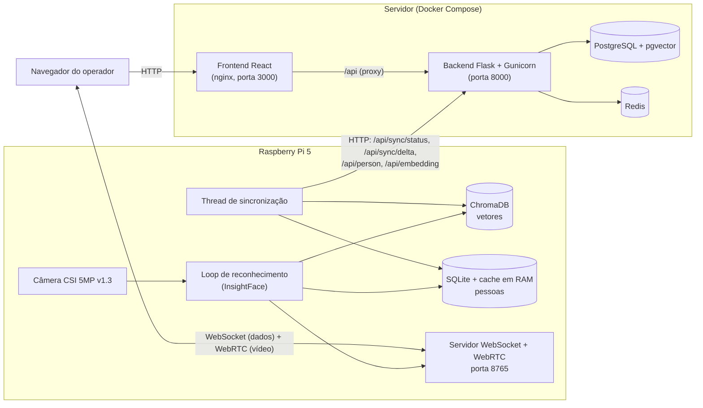

# Vision Face

Sistema de **reconhecimento facial em tempo real** com câmera em uma Raspberry Pi 5, cadastro centralizado de pessoas em um servidor e painel web de monitoramento.

A câmera fica na Raspberry. Ela detecta rostos, gera uma *embedding* (vetor numérico de 512 valores que representa o rosto) e compara com as pessoas cadastradas. O resultado e o vídeo ao vivo vão direto para o navegador do operador. O cadastro de pessoas e embeddings fica no servidor, e a Raspberry mantém uma cópia local sincronizada para reconhecer rostos sem depender de internet a cada frame.

---

## Sumário

1. [Visão geral](#1-visão-geral)
2. [Arquitetura](#2-arquitetura)
3. [Tecnologias e para que cada uma serve](#3-tecnologias-e-para-que-cada-uma-serve)
4. [Estrutura do repositório](#4-estrutura-do-repositório)
5. [Como o sistema funciona (fluxos)](#5-como-o-sistema-funciona-fluxos)
6. [Variáveis de ambiente](#6-variáveis-de-ambiente)
7. [Rodando o servidor com Docker (passo a passo)](#7-rodando-o-servidor-com-docker-passo-a-passo)
8. [Rodando a Raspberry](#8-rodando-a-raspberry)
9. [Usando o painel](#9-usando-o-painel)
10. [Referência da API e do WebSocket](#10-referência-da-api-e-do-websocket)
11. [Desenvolvimento local sem Docker](#11-desenvolvimento-local-sem-docker)
12. [Problemas comuns](#12-problemas-comuns)
13. [Privacidade e uso responsável](#13-privacidade-e-uso-responsável)

---

## 1. Visão geral

| Problema | Como o projeto resolve |
| --- | --- |
| Reconhecer rostos na câmera em tempo quase real, em hardware pequeno | A Raspberry Pi 5 roda a detecção e o reconhecimento localmente (InsightFace + ONNX Runtime, só CPU). |
| Não depender da internet/servidor a cada rosto | A Raspberry guarda uma cópia local das pessoas (SQLite) e dos vetores (ChromaDB) e compara localmente. |
| Cadastrar pessoas em um só lugar | O servidor (Flask + PostgreSQL com pgvector) é a fonte da verdade; a Raspberry sincroniza por **delta** (só o que mudou). |
| Ver a câmera e os rostos no navegador, sem plugin | A Raspberry transmite vídeo por **WebRTC** e envia os dados por **WebSocket**; o painel React exibe tudo. |
| Cadastrar quem ainda não é conhecido | Rostos não reconhecidos aparecem no painel com botão **Adicionar**, que atrela a embedding a uma pessoa existente ou nova. |

O painel mostra, em tempo real: vídeo da câmera com caixas nos rostos, FPS real da câmera, dados da pessoa reconhecida (nome, nascimento, idade, se é procurada e o motivo), embeddings de rostos desconhecidos e o horário da próxima sincronização da Raspberry.

---

## 2. Arquitetura



Pontos importantes:

- O **navegador conecta direto na Raspberry** (WebSocket + WebRTC). O servidor Docker não passa vídeo nem detecções; ele só entrega o site e a API de cadastro.
- A **Raspberry conecta no servidor** (HTTP) apenas para sincronizar cadastros. Se o servidor cair, o reconhecimento continua funcionando com os dados já sincronizados.
- O navegador precisa conseguir alcançar o IP da Raspberry (mesma rede local, por exemplo).

---

## 3. Tecnologias e para que cada uma serve

### Raspberry Pi (`raspberry/`)

| Tecnologia | Função no projeto |
| --- | --- |
| **Raspberry Pi 5 (8 GB) + Pi OS 64 bits** | Hardware e sistema que rodam o reconhecimento facial localmente. |
| **Picamera2 / libcamera** | Captura os frames da câmera CSI. |
| **InsightFace (modelo `buffalo_l`)** | Detecta rostos e gera a embedding de 512 valores de cada rosto. |
| **ONNX Runtime (CPU)** | Executa os modelos do InsightFace na Raspberry (sem GPU). |
| **ChromaDB** | Banco vetorial local. Busca o vetor cadastrado mais próximo (distância de cosseno) da embedding capturada. |
| **SQLite + SQLAlchemy** | Guarda os dados das pessoas, a versão da sincronização e a fila (`outbox`) de exclusões. Um dicionário em RAM evita consultar o SQLite a cada frame. |
| **requests** | Cliente HTTP da sincronização com a API do servidor. |
| **websockets** | Servidor WebSocket: envia rostos, status, FPS e estado da sincronização; troca a sinalização do WebRTC. |
| **aiortc + PyAV** | WebRTC: transmite o vídeo da câmera ao navegador (limitado a 20 FPS). |
| **python-dotenv** | Carrega o `.env` da raiz do repositório. |

### Servidor (`server/`)

| Tecnologia | Função no projeto |
| --- | --- |
| **Docker Compose** | Sobe todo o servidor (Postgres, Redis, backend, frontend) com um comando. |
| **Flask + Flask-RESTX** | API REST e documentação Swagger (`/api/docs`). |
| **Gunicorn** | Servidor de produção do Flask dentro do container. |
| **PostgreSQL + pgvector** | Banco principal. A extensão `pgvector` permite guardar a embedding como coluna vetorial de 512 dimensões. |
| **SQLAlchemy + Flask-Migrate (Alembic)** | Modelos e migrations automáticas: o container aplica `flask db upgrade` ao iniciar. |
| **Marshmallow** | Serialização e validação dos dados da API. |
| **Redis** | Provisionado no Compose para uso futuro do backend (cache/sessões). A conexão está comentada em `server/backend/server/instance.py`, mas `REDIS_HOST` e `REDIS_PORT` continuam obrigatórios na validação de configuração. |
| **React 19 + Vite** | Painel web: monitoramento ao vivo e CRUD de pessoas e embeddings. |
| **nginx** | Serve o build do frontend e faz proxy de `/api/` para o backend (evita CORS). |
| **WebRTC / WebSocket (API do navegador)** | Recebe vídeo e dados direto da Raspberry. |

### Por que sincronização por delta?

Cada alteração no backend (pessoa ou embedding inserida, alterada ou removida) gera um registro na tabela `sync_change` com um número de **versão** crescente. A Raspberry guarda a última versão aplicada e pergunta `GET /api/sync/delta/<versão>`; recebe só o que mudou depois dela. Exclusão de pessoa usa a tabela `outbox` para garantir que os vetores dela também saiam do ChromaDB, mesmo se houver falha no meio.

---

## 4. Estrutura do repositório

```
Vision-Face/
├── .env.example              # modelo de todas as variáveis de ambiente
├── docker-compose.yml        # postgres, redis, backend, frontend
├── README.md                 # este arquivo
├── raspberry/
│   ├── readme.md             # guia completo de montagem e execução da Raspberry
│   ├── src/
│   │   ├── main.py           # ponto de entrada (inicia sync, rede e reconhecimento)
│   │   ├── ws_server.py      # WebSocket + WebRTC para o navegador
│   │   ├── network_monitor.py# loga estado do Wi-Fi e o endereço ws://IP:porta
│   │   ├── recognition/      # camera.py, face_engine.py, runner.py, video_track.py
│   │   ├── sync/             # sincronização com o backend (delta + outbox)
│   │   ├── database/         # SQLite, ChromaDB e cache em RAM
│   │   └── requirements.txt
│   └── tests/                # scripts de teste da câmera e da captura de embeddings
└── server/
    ├── backend/              # API Flask (apis/, models/, schemas/, migrations/, web/)
    ├── frontend/             # painel React/Vite + nginx.conf + Dockerfile
    └── postgres/init.sql     # habilita a extensão pgvector
```

---

## 5. Como o sistema funciona (fluxos)

### 5.1 Reconhecimento (na Raspberry)

1. `main.py` inicializa o SQLite, carrega as pessoas para o cache em RAM e inicia três atividades: **sincronização** (thread), **monitor de rede** (thread) e **loop de reconhecimento** (thread principal).
2. O loop captura um frame (1280×720) e o entrega ao WebRTC (vídeo ao vivo).
3. O InsightFace detecta os rostos e gera, para cada um, a bounding box e a embedding normalizada.
4. Rostos com score de detecção abaixo de `FACE_MIN_DETECTION_SCORE` são ignorados.
5. A embedding é buscada no ChromaDB (vizinho mais próximo, distância de cosseno). Se a distância for menor ou igual ao limite (`0.4` por padrão para cosseno, ou `FACE_MATCH_DISTANCE_THRESHOLD`), o rosto é **reconhecido** e os dados da pessoa vêm do cache em RAM. Caso contrário, é **não reconhecido**.
6. A cada frame, a Raspberry envia pelo WebSocket a mensagem `faces` com todos os rostos do frame. A cada segundo, envia `status` com FPS da câmera e estado da sincronização.

### 5.2 Sincronização (Raspberry ← servidor)

A cada `SYNC_INTERVAL_SECONDS` (30 s por padrão):

1. Processa a fila `outbox` (exclusões pendentes no ChromaDB).
2. Consulta `GET /api/sync/status` para saber a versão mais recente do servidor.
3. Se a versão local for menor, chama `GET /api/sync/delta/<versão_local>`.
4. Aplica cada mudança em ordem: pessoas vão para o SQLite e o cache em RAM; embeddings vão para o ChromaDB (buscando os vetores em `GET /api/embedding/`).
5. Atualiza a versão local e agenda a próxima sincronização.

O painel mostra "Sincronizando…" ou "Próxima sync: HH:MM:SS (em Ns)", então depois de cadastrar uma pessoa ou embedding você sabe quando a Raspberry vai passar a reconhecê-la.

### 5.3 Cadastro a partir de um rosto desconhecido

1. Um rosto não reconhecido aparece no card **Rostos identificados** com sua embedding.
2. Clique em **Adicionar**. Escolha uma pessoa existente e o ângulo (ex.: `frontal`, `diagonal`), ou clique em **Cadastrar nova pessoa**.
3. Ao cadastrar a nova pessoa, a embedding é atrelada a ela automaticamente com o ângulo informado.
4. Na próxima sincronização, a Raspberry recebe a embedding e passa a reconhecer essa pessoa.

---

## 6. Variáveis de ambiente

Existe **um único arquivo `.env`, na raiz do repositório**, usado pelo Docker Compose, pelo backend, pelo frontend (build) e pela Raspberry. Crie a partir do exemplo:

```bash
cp .env.example .env          # Linux/macOS/Raspberry
copy .env.example .env        # Windows (cmd)
```

O `.env` não vai para o Git. Variáveis já definidas no ambiente têm prioridade sobre o arquivo.

| Variável | Quem usa | Descrição |
| --- | --- | --- |
| `POSTGRES_DB`, `POSTGRES_USER`, `POSTGRES_PASSWORD` | Postgres, backend | Banco e credenciais. **Troque a senha.** |
| `POSTGRES_PORT` | Docker | Porta publicada em `127.0.0.1` para acessar o banco com pgAdmin (padrão 5432). |
| `DATABASE_URL` | Backend fora do Docker | URI do Postgres usada ao rodar o Flask localmente. No Docker o compose monta a URI com o host `postgres`. |
| `REDIS_HOST`, `REDIS_PORT` | Backend | Redis (`redis` / `6379` no Docker). |
| `SECRET_KEY`, `SECURITY_PASSWORD_SALT` | Backend | Segredos do Flask. Use valores aleatórios longos. |
| `BACKEND_IP`, `BACKEND_PORT` | Backend, Docker | Interface e porta publicada da API (padrão `0.0.0.0` e `8000`). |
| `ENV` | Backend | `production` usa `DATABASE_URL` (Postgres). Qualquer outro valor usa SQLite local. |
| `FLASK_APP` | Backend | `main`. |
| `FRONTEND_PORT` | Docker | Porta publicada do painel (padrão `3000`). |
| `RASPBERRY_WS_URL` | Frontend (**build**) | Endereço `ws://IP_DA_RASP:8765` que já vem preenchido no painel. É lido na hora do build; ao mudar, refaça o build do frontend. |
| `API_URL` | Raspberry | URL da API do backend vista pela Raspberry, ex.: `http://IP_DO_SERVIDOR:8000/api`. |
| `SYNC_INTERVAL_SECONDS` | Raspberry | Intervalo entre sincronizações (padrão 30). |
| `WEBSOCKET_HOST`, `WEBSOCKET_PORT` | Raspberry | Onde o WebSocket escuta (padrão `0.0.0.0` e `8765`). |
| `INSIGHTFACE_MODEL` | Raspberry | Pacote de modelos (padrão `buffalo_l`, com a letra "l"). |
| `FACE_MIN_DETECTION_SCORE` | Raspberry | Score mínimo do detector, de 0 a 1 (padrão 0.5). |
| `FACE_MATCH_DISTANCE_THRESHOLD` | Raspberry | Distância máxima para considerar um rosto reconhecido. Vazio usa o padrão (0.4 para cosseno). Menor = mais rigoroso. |
| `FACE_LOG_FULL_EMBEDDING` | Raspberry | `true` registra o vetor completo nos logs (muito volumoso e expõe dado biométrico). |

Dois endereços diferentes, não confunda:

- `API_URL` é o **servidor visto pela Raspberry**.
- `RASPBERRY_WS_URL` é a **Raspberry vista pelo navegador**.

---

## 7. Rodando o servidor com Docker (passo a passo)

**Pré-requisitos:** Docker Desktop (Windows/macOS) ou Docker Engine + Compose (Linux) e Git.

1. **Clone o repositório**
   ```bash
   git clone <URL_DO_REPOSITORIO> Vision-Face
   cd Vision-Face
   ```
2. **Crie o `.env`** a partir do exemplo (veja a [seção 6](#6-variáveis-de-ambiente)):
   ```bash
   cp .env.example .env
   ```
3. **Edite o `.env`**:
   - Troque `POSTGRES_PASSWORD` (e a mesma senha dentro de `DATABASE_URL`).
   - Troque `SECRET_KEY` e `SECURITY_PASSWORD_SALT` por valores aleatórios.
   - Defina `RASPBERRY_WS_URL` com o IP da sua Raspberry, ex.: `ws://192.168.15.103:8765`.
   - Defina `API_URL` com o IP do computador/servidor onde o Docker roda, ex.: `http://192.168.15.50:8000/api` (usado pela Raspberry).
4. **Suba os containers**
   ```bash
   docker compose up --build -d
   ```
   Ordem de inicialização: Postgres e Redis ficam saudáveis, o backend aplica as migrations e inicia o Gunicorn, e só então o frontend sobe.
5. **Acompanhe**
   ```bash
   docker compose ps
   docker compose logs -f backend
   ```
6. **Acesse**
   - Painel: <http://localhost:3000>
   - API: <http://localhost:8000/api/person/> (deve devolver uma lista JSON, possivelmente vazia)
   - Documentação Swagger: <http://localhost:8000/api/docs>

**Comandos úteis**

```bash
docker compose down                        # para tudo (mantém o banco)
docker compose down -v                     # para tudo e APAGA o banco
docker compose up -d --build frontend      # refaz só o frontend (necessário ao mudar RASPBERRY_WS_URL)
docker compose logs -f frontend            # logs do nginx
```

**Portas ocupadas:** altere `FRONTEND_PORT` e `BACKEND_PORT` no `.env`. Lembre de ajustar a porta em `API_URL`.

**Firewall (Windows):** para a Raspberry alcançar a API, libere a porta `8000` de entrada no Firewall do Windows para a rede privada.

---

## 8. Rodando a Raspberry

O guia completo, desde a compra e montagem do hardware até a execução, está em **[raspberry/readme.md](raspberry/readme.md)**. Resumo do que você vai fazer:

1. Montar o hardware (Pi 5, câmera 5 MP v1.3 com cabo adaptador no conector CAM0, fonte de 27 W).
2. Gravar o Raspberry Pi OS 64 bits com SSH e Wi-Fi configurados.
3. Conectar por SSH, atualizar com `apt` e validar a câmera.
4. Clonar o projeto, criar o ambiente virtual e instalar as dependências.
5. Configurar o `.env` (principalmente `API_URL`) e rodar `python main.py`.

Ao subir, o log mostra o endereço para colocar no painel, por exemplo `WebSocket address: ws://192.168.15.103:8765`.

---

## 9. Usando o painel

Acesse <http://localhost:3000>.

**Visão ao vivo**

- Campo **Endpoint da Raspberry**: já vem com o valor de `RASPBERRY_WS_URL`. Clique em **Conectar**. O botão vira **Desconectar** enquanto houver conexão.
- O vídeo aparece com caixas nos rostos (laranja = pessoa procurada, verde = demais rostos, reconhecidos ou não). O **FPS** real da câmera aparece no canto do vídeo e no rodapé do painel.
- O card **Rostos identificados** lista só os rostos que estão na câmera neste momento. Para reconhecidos, mostra nome, nascimento, idade e alerta de procurado. Para desconhecidos, mostra a embedding e o botão **Adicionar**.
- No topo, o indicador de sincronização mostra quando a Raspberry vai sincronizar de novo.

**Pessoas cadastradas**: cadastro, edição e exclusão de pessoas e das suas embeddings. Datas no formato brasileiro `dd/mm/aaaa`.

**Embeddings**: lista de todos os vetores cadastrados, com busca e edição.

---

## 10. Referência da API e do WebSocket

### API REST (`/api`)

| Método e rota | Descrição |
| --- | --- |
| `GET/POST /person/` | Lista e cria pessoas. |
| `GET/PUT/DELETE /person/<id>` | Consulta, altera e remove uma pessoa (e suas embeddings). |
| `GET /embedding/` | Lista todas as embeddings. |
| `GET/POST /embedding/<person_id>/embeddings` | Lista e cria embeddings de uma pessoa (vetor com exatamente 512 valores). |
| `PUT/DELETE /embedding/<person_id>/embeddings/<id>` | Altera e remove uma embedding. |
| `GET /sync/status` | Versão mais recente dos dados. |
| `GET /sync/delta/<versão>` | Mudanças ocorridas depois da versão informada. |

A documentação interativa completa fica em `/api/docs`.

### WebSocket da Raspberry (porta 8765)

Mensagens enviadas **pela Raspberry**:

```json
{"type":"offer","sdp":{"type":"offer","sdp":"..."}}
{"type":"ice-candidate","candidate":{"candidate":"...","sdpMid":"0","sdpMLineIndex":0}}
{"type":"status","camera_online":true,"fps":12.4,
 "sync":{"syncing":false,"backend_online":true,"last_sync_at":"2026-01-01T12:00:00+00:00",
         "next_sync_at":"2026-01-01T12:00:30+00:00","next_sync_in":18.2,"interval_seconds":30}}
{"type":"faces","frame_size":{"width":1280,"height":720},"faces":[
  {"recognized":true,"person":{"id":1,"name":"Nome","date_birth":"1990-01-01","wanted":false,"reason":null},
   "embedding":[0.01,"... 512 valores"],"model":"buffalo_l",
   "box":{"x":120,"y":60,"width":180,"height":220},"distance":0.21}
]}
```

Para um rosto não reconhecido, `recognized` é `false` e `person` é `null`. Mensagens enviadas **pelo navegador**: `answer` (resposta WebRTC) e `ice-candidate`.

Fluxo WebRTC: o navegador abre o WebSocket, a Raspberry envia a `offer`, o navegador responde com `answer`, e os dois trocam `ice-candidate`. O vídeo passa a fluir direto por WebRTC (usa o STUN público do Google para descobrir caminhos de rede).

---

## 11. Desenvolvimento local sem Docker

**Frontend** (Node 22):

```bash
cd server/frontend
npm install
npm run dev          # http://localhost:5173, encaminha /api para http://localhost:8000
```

O proxy usa `http://localhost:<BACKEND_PORT>` (lido do `.env` da raiz; padrão 8000).

**Backend** (Python 3.13): suba o Postgres e o Redis pelo Docker (`docker compose up -d postgres redis`), instale `server/backend/requirements.txt` em um ambiente virtual e rode a partir da pasta `server`:

```bash
flask --app backend.main:app db upgrade
flask --app backend.main:app run --port 8000
```

Use `DATABASE_URL` com host `localhost` nesse caso.

---

## 12. Problemas comuns

| Sintoma | Causa provável e solução |
| --- | --- |
| Painel não conecta na Raspberry | Confira se o `main.py` está rodando e se o IP/porta do log são os mesmos do campo de endpoint. Navegador e Raspberry precisam estar na mesma rede. |
| O campo de endpoint abre vazio ou com endereço antigo | `RASPBERRY_WS_URL` é lida no build: rode `docker compose up -d --build frontend`. Um endereço salvo antes fica no `localStorage` do navegador; limpe os dados do site. |
| Site em `https` não conecta em `ws://` | Navegadores bloqueiam `ws://` em página `https`. Use `wss://` por proxy/túnel ou acesse o painel por `http` na rede local. |
| Vídeo preto, mas conectado | Reconecte. Verifique no log da Raspberry mensagens de WebRTC e da câmera. |
| Raspberry não sincroniza ("Backend offline" no painel) | `API_URL` incorreta, servidor inacessível ou firewall bloqueando a porta 8000. Teste na Raspberry: `curl http://IP_DO_SERVIDOR:8000/api/sync/status`. |
| Pessoa cadastrada não é reconhecida | Aguarde a próxima sincronização. Cadastre embeddings de ângulos diferentes. Ajuste `FACE_MATCH_DISTANCE_THRESHOLD` com cuidado. |
| FPS baixo | O reconhecimento roda na CPU da Raspberry; o FPS mostrado já inclui o tempo do reconhecimento. Mais rostos no frame e `det_size` maior reduzem o FPS. |
| Backend não sobe | Veja `docker compose logs backend`. Confira se todas as variáveis obrigatórias estão no `.env`. |

---

## 13. Privacidade e uso responsável

Embeddings faciais são **dados biométricos sensíveis**. Use somente com base legal e consentimento adequados (no Brasil, observe a LGPD), proteja o banco, não habilite `FACE_LOG_FULL_EMBEDDING` em produção e troque todas as senhas e chaves do exemplo. Identificações são automatizadas e **devem ser verificadas por uma pessoa** antes de qualquer ação.
